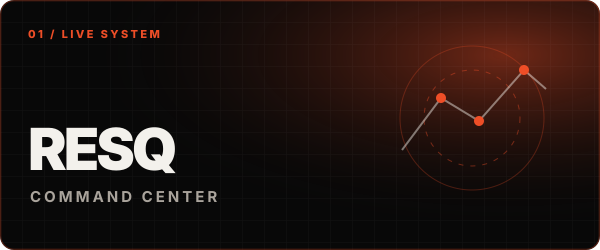
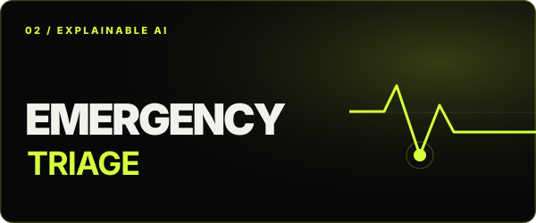
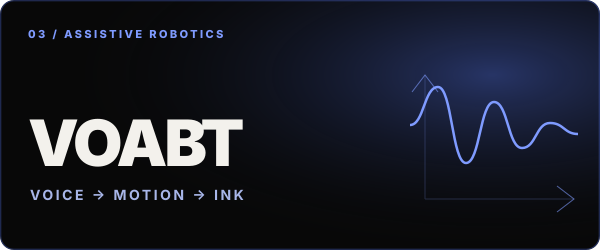
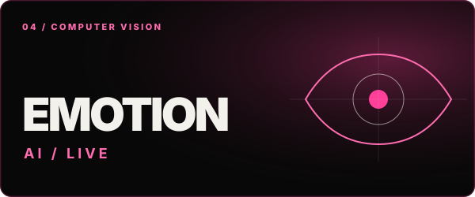

  

  
  
  

 

<table>
  <tr>
    <td width="68%" valign="middle">
      <h2>Creative engineer for products and systems that are built to move forward.</h2>
      

        I’m <strong>Jebarson Caleb D</strong> — a software engineer and product builder working where
        full-stack platforms, applied AI, embedded systems, and robotics meet.
      

      

        I turn ambitious concepts into dependable code, tangible hardware, and experiences people can actually use.
      

      
<code>SOFTWARE</code> <code>SYSTEMS</code> <code>AI</code> <code>ROBOTICS</code>

    </td>
    <td width="32%" align="center" valign="bottom">
      
       
      TIRUPUR, INDIA · KITS ’28
    </td>
  </tr>
</table>

## Selected work

<table>
  <tr>
    <td width="50%" valign="top">
      
      <h3><a href="https://github.com/jebarson-caleb/disaster">ResQ Command ↗</a></h3>
      
A full-stack disaster-response command center for reporting, triage, dispatch, public warnings, shelters, hospitals, logistics, and welfare checks.

      
<code>Python</code> <code>Flask</code> <code>Vite</code> <code>PostgreSQL</code>

      
<a href="https://disaster-delta-eight.vercel.app/"><strong>LIVE BETA ↗</strong></a>

    </td>
    <td width="50%" valign="top">
      
      <h3><a href="https://github.com/jebarson-caleb/intel_phase2">Emergency Response Triage ↗</a></h3>
      
Offline-capable emergency triage with voice intake, explainable ML decisions, encrypted patient data, and a rule-first safety engine.

      
<code>FastAPI</code> <code>Streamlit</code> <code>TensorFlow</code> <code>Docker</code>

    </td>
  </tr>
  <tr>
    <td width="50%" valign="top">
      
      <h3><a href="https://github.com/jebarson-caleb/Voice-Activated-Cartesian-Bot-VOABT-">Voice-Activated Cartesian Bot ↗</a></h3>
      
An assistive robotics system that transforms natural speech into handwriting through Whisper, G-code generation, and GRBL motion control.

      
<code>Python</code> <code>Whisper</code> <code>C</code> <code>GRBL</code>

    </td>
    <td width="50%" valign="top">
      
      <h3><a href="https://github.com/jebarson-caleb/facial-recognition-system">Emotion AI ↗</a></h3>
      
A real-time vision pipeline for webcam face detection, tracking, and seven-class emotion recognition with MTCNN/OpenCV and Keras.

      
<code>Python</code> <code>OpenCV</code> <code>MTCNN</code> <code>Keras</code>

    </td>
  </tr>
</table>

## Tools I build with

  

## GitHub signal

  

Generated from the GitHub API and refreshed automatically each week. Stars and language totals exclude forks.

 

  <h3>Have an ambitious idea?</h3>
  
Let’s turn it into a system that works.

  
    
  <a href="https://jebarson-caleb-github-io.vercel.app/">PORTFOLIO</a> / <a href="https://www.linkedin.com/in/jebarson-caleb/">LINKEDIN</a> / <a href="https://github.com/jebarson-caleb">GITHUB</a>

