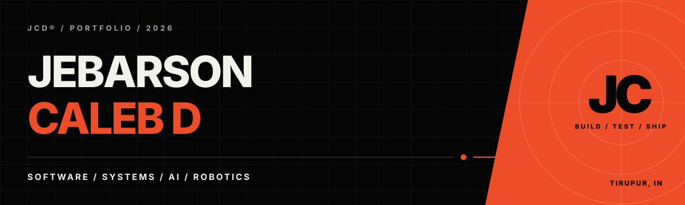
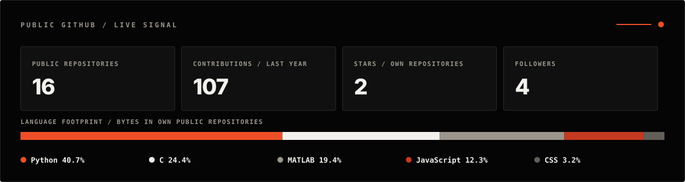

  

  
  
  
  

 

> I build intelligent products that connect ambitious ideas to useful, real-world systems.

I’m **Jebarson Caleb D**, a software engineer and product builder working across full-stack platforms, applied AI, embedded systems, and robotics. I’m currently studying Computer Science at Karunya Institute of Technology and Sciences (2024–2028).

My favorite work lives in the difficult middle: turning an ambitious concept into dependable code, tangible hardware, and an experience people can actually use.

## Now shipping

### [01 / ResQ Command ↗](https://github.com/jebarson-caleb/disaster)

**A full-stack disaster-response command center.** ResQ Command brings citizen incident reporting, rescue triage and dispatch, public warnings, hospital and shelter coordination, relief logistics, welfare checks, supply requests, and donations into one operational system.

`Python` `Flask` `JavaScript` `Vite` `PostgreSQL` `Vercel`

[Open the live beta](https://disaster-delta-eight.vercel.app/) · [Explore the source](https://github.com/jebarson-caleb/disaster)

## Selected systems

### [02 / Emergency Response Triage ↗](https://github.com/jebarson-caleb/intel_phase2)

Offline-capable, AI-assisted emergency triage with voice and text intake, explainable decisions, encrypted patient-data storage, and a rule-first safety engine.

`FastAPI` `Streamlit` `TensorFlow` `SQLite` `Docker`

### [03 / Voice-Activated Cartesian Bot ↗](https://github.com/jebarson-caleb/Voice-Activated-Cartesian-Bot-VOABT-)

An assistive robotics system that turns natural speech into handwriting using Whisper-powered transcription, G-code generation, and GRBL motion control.

`Python` `Whisper` `C` `GRBL` `CNC`

### [04 / Facial Recognition & Emotion AI ↗](https://github.com/jebarson-caleb/facial-recognition-system)

A real-time computer-vision pipeline for webcam face detection, tracking, and seven-class emotion recognition with MTCNN/OpenCV and Keras.

`Python` `OpenCV` `MTCNN` `Keras` `TensorFlow`

## Working set

  
  
  
  
  
  
  
  
  
  

## GitHub signal

  

This graphic is generated from the GitHub API and refreshed automatically each week. Stars and language totals exclude forks.

## Elsewhere

- Browse the full visual case studies on my [portfolio](https://jebarson-caleb.github.io/).
- Follow what I’m building on [LinkedIn](https://www.linkedin.com/in/jebarson-caleb/).
- Start a conversation at [jebarsoncalebd@gmail.com](mailto:jebarsoncalebd@gmail.com).

 

  JEBARSON CALEB D · TIRUPUR, INDIA · BUILD / TEST / SHIP

